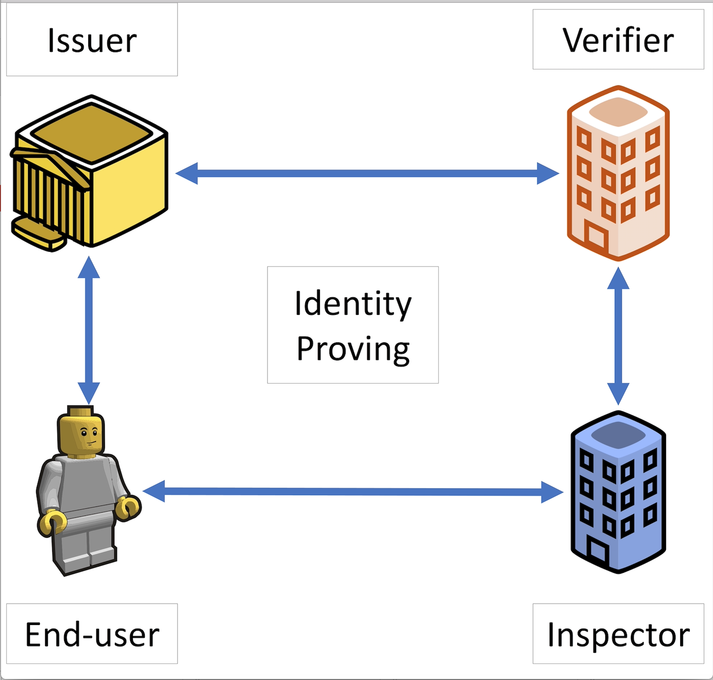
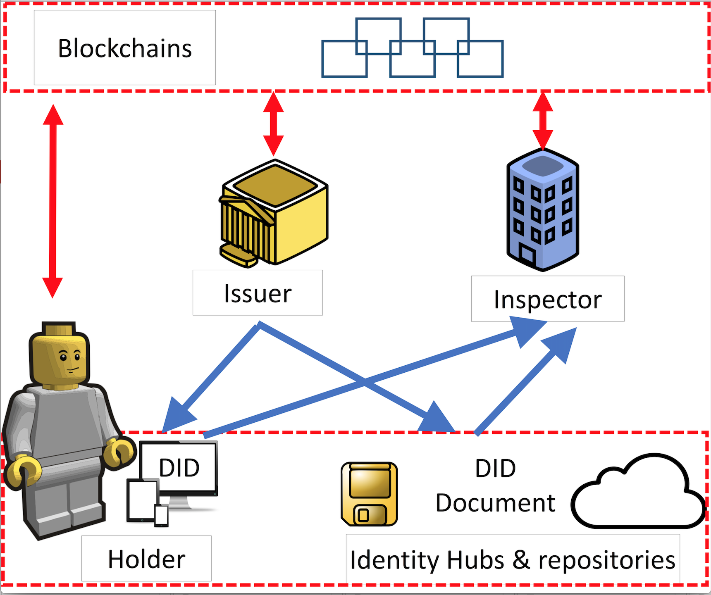
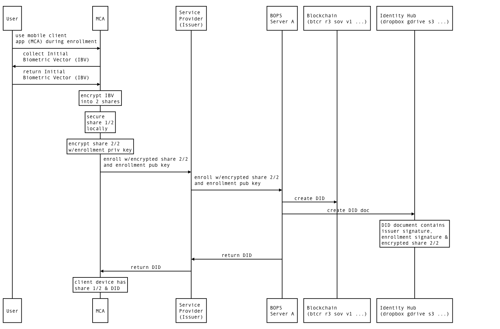
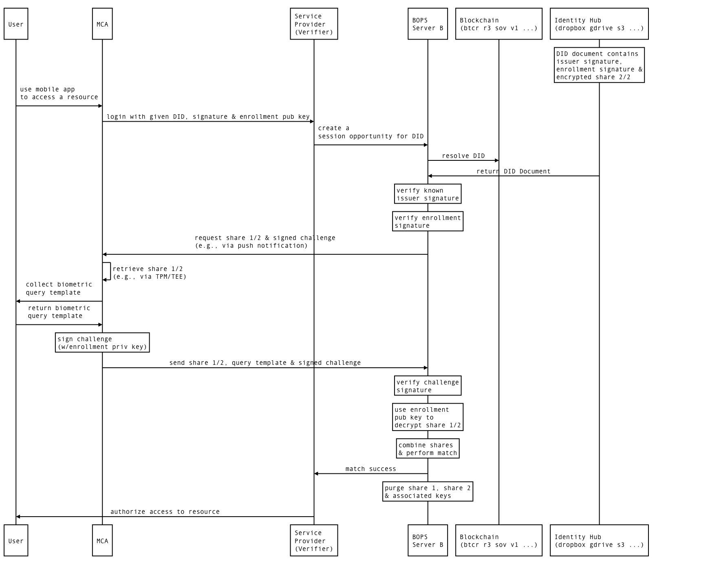
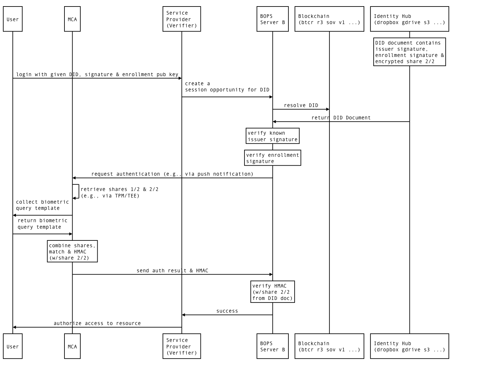

# The Horcrux Protocol: A Method for Decentralized Biometric-based Self-sovereign Identity

Most user authentication methods and identity proving systems rely on
a centralized database. Such information storage presents a single
point of compromise from a security perspective. If this system is
compromised it poses a direct threat to users' digital
identities. This paper proposes a decentralized authentication method,
called the Horcrux[^1] protocol, in which there is no such single
point of compromise. The protocol relies on decentralized identifiers
(DIDs) under development by the W3C Verifiable Claims Community Group
and the concept of self-sovereign identity. To accomplish this, we
propose specification and implementation of a decentralized biometric
credential storage option via blockchains using DIDs and DID documents
within the IEEE 2410-2017 Biometric Open Protocol Standard (BOPS).

Authors: Asem Othman and John Callahan, Veridium IP Ltd, 

Keywords: Blockchain, IEEE BOPS, self-sovereign identity,
authentication factors, digital identity, distributed authentication
architecture

Introduction
============

Digital transformation, mobility and the proliferation of applications
and networks have made traditional forms of information protection
increasingly difficult to manage and enforce. Information is everywhere,
access is widely distributed, but most security programs are still
largely based on archaic, static models that just don't work anymore and
it is getting worse.

The latest evidence of this is recent breach disclosed by Equifax
[@hume2004identity] that has exposed identity information for over 140
million individuals. Enterprises continue to take on enormous risk by
aggregating unnecessary personal data while customers can't manage the
massive number of IDs, passwords and data required to interact with
every on-line connection.

We believe that the common denominator across most aspects of
information protection is identity. An identity is inextricably linked
to a person, device, application, system or network and it is the most
dependable 'perimeter' we can rely upon to determine how to make
information available properly and securely. Identity management will
soon have to make the leap from our age-old approaches of multiple user
IDs and passwords to a new, secure, privacy-centric means of identity
authentication.

An identity ecosystem leverages personas that can both protect privacy
(and reduced liability for the enterprise), provide distributed access
to authorized services and provide the user a full-control over their
identity accessing. User authentication presents one of the basic
security requirements in this identity ecosystem. Generally speaking,
authentication can be described as a process in which a user offers some
form of proof that he is the same user who registered the account. A
proof of identity can be any piece of information that an authentication
server accepts: something users have in their possession, something they
know or something they are (e.g., a biometric).

Traditional Authentication models
---------------------------------

In current practice, only one centralized database is in charge of
storing the data used for authentication. When the user offers the
requested proof of identity, the authentication server evaluates this
proof and grants access to the user. For example, when a user tries to
access his account on a typical web application he is prompted to enter
a password. Traditionally, the web application holds the information
about the user's account and his password. When the user submits his
password during log-in process, the application compares the stored
password to the submitted password. If they match, the user is granted
access to the application. In other words, all the information needed to
authenticate the user is held on a single system. Even if the
authentication system is biometric-based system, most of the deployed
systems is still use the same centralized model.

Biometric-based authentication systems
[@jain2004introductiontobiometrics] operate in two main stages:
enrollment and recognition. The enrollment stage generates a digital
representation of an individual's biometric trait and then stores this
representation called biometric template in a centralized system
database. During the recognition stage, which can be operate in two
modes: verification and identification, the system require that the
acquired probe biometric template to be matched against a single
template (in the verification mode) or all template (in the
identification mode) stored in the centralized database.

This makes such systems the single point of compromise for securing
digital identities. In other words, in case an attacker gains access to
the web application or the biometric centralized database, he can
extract enough information to compromise the user's digital identity
[@jain2008biometric]. Moreover, since many users tend to use the same
password or biometric trait in different applications, revealing their
identity on one compromised database can lead to unlawful access into
other accounts and services.

In some current implementations, the authentication server can be
completely separated from the server running web applications or
biometric authentication database . For example, single sign-on (SSO)
schemes [@radha2012survey] are based on this concept. SSO schemes rely
on a third-party identity provider (IdP) to broker authentication using
protocols such as SAML [@hughes2005security] and OpenID Connect
[@sakimura2011openid]. Since their introduction in 2002 and 2010
respectively, only 5% of sites use any of over 50 disparate IdP
[@vapen2016look] SSO services (e.g., "login with Facebook", "login with
Google", etc.). Loopholes in these centralized IdP-based SSO systems are
the main reasons for the many hacks of personal information
[@hume2004identity] and even loss of biometric data [@zetter2015opm].
Surveys of users show an overwhelming dissatisfaction with
single-sign-on (SSO), a feeling of "lack of control" over their data
[@innovalor2016; @mertens2015digital; @rose2012value; @satchell2011identity]
and a desire to control it themselves. Upcoming legislation, such as the
General Data Protection Regulations (GDPR) [@koops2014privacy] and
Payment Services Directive II (PSD2) [@cortet2016psd2], are pressuring
institutions, both private and public, to place citizen or customer data
into the end user's control.

Traditional Identity Proving Methods
------------------------------------

Current identity proving methods (see Figure
[\[fig:OldEcoSystem\]](#fig:OldEcoSystem){reference-type="ref"
reference="fig:OldEcoSystem"}) rely on specific parties: an *issuer*,
*end-user*, *verifier*, and *inspector*.

Issuers such as governments associate identity credentials to end-users.
Then, the issuer shares personal information and credentials of the
end-user with a verifier. If the end-user applies for a bank account,
credit card, or car loan, the inspector contacts a verifier to prove the
claimed identity by the end-user. Therefore, especially if this process
is online, the inspector presents a multiple-choice quiz about past
addresses or who financed the user's last car. That's an identity
verification service that verifier provides to lenders and others, i.e.,
inspectors. Based on the answers or prove of holding the credentials,
the inspector will verify the claimed identity by the end-user and
grantee the required service. This ecosystem has the same security flaw
as the traditional authentication systems, end-user personal data (e.g.,
SSN, addresses, birthdate, etc.) are stored in a centralized database of
the verifier.

Our Contribution
----------------

The aforementioned security flaws encapsulate perfectly why a new
identity ecosystem is so important: identity is the new attack surface
[@los2016]. In traditional authentication and identity models, users are
forced to relinquish personal information such as credit histories,
credentials such as birth certificate, or biometric data such
fingerprint template to a third party, with a centralized database.

*Self-sovereign identity* is a new decentralized ecosystem for private
and secure identity management that is being implemented by several
projects [@reed2017beyond; @ali2016blockstack; @lundkvist2016uport] as
the replacement of the traditional identity proving systems.
Self-sovereign identity puts end-users --- not the organizations that
traditionally centralize identity --- in charge of decisions about their
own privacy and disclosure of their personal information and
credentials. Self-sovereign identity utilizes distributed ledgers, i.e.,
blockchain technology, to establish a web-of-trust [@wot]. These
blockchains are a form of databases that is provided cooperatively by a
set of organizations, instead of by a central database with a central
organization. A single blockchain is copied redundantly in many places,
and it accrues transactions orchestrated by many machines. In other
words, the new identity model is a reliable, public identity proving
system under no single entity's control, robust to system failure and
hacking.

In this paper, we discuss the specification and implementation of our
Horcrux protocol that combines the decentralized self-sovereign identity
ecosystem with 2410-2017 IEEE Biometric Open Protocol Standard
(BOPS)[@BOPS-2017]. The BOPS protocol is extensible to a combination of
on-device (FIDO UAF [@FIDO-UAF-2014] compatible), server-side or a
multi-distribution model that utilizes a secret scheme. Indeed, the
standard allows for off-device biometric credentials under user control.
The device's local TPM is only one option (though dominant at the
moment) for persisting biometric credentials and associated key(s).

The Horcrux protocol allows the end-users of self-sovereign identity to
have the control of accessing their identities by giving the consent to
this verification process via a biometric authentication process.
Moreover, We propose the use of the existing BOPS due to its
multi-distribution scheme of storing biometric data. BOPS utilizes a
secret scheme to divide the templates into $n \leq 2$ shares as
specified in IEEE 2410-2017. Therefore, biometric data used for
authentication will be distributed by BOPS and securely stored in
decentralized storages and securely referenced to them by blockchains
technology. The multiple shares (and potentially redundant shares) could
be spread across alternate off-chain storage (like IPFS, Dropbox, Google
drive, etc.) as designed in the self-sovereign ecosystem.

This marriage of these two identity models (DIDs and BOPS) is the
Horcrux protocol which guarantees the following principles:

-   *Existence*: users must have an independent existence that can not
    only exist wholly in the digital form, and by using biometric-based
    protocol for enrolling and authentication, this guarantees that the
    digital identity has been created and will always be verified by an
    existence end-user.

-   *Control*: users must control the storage and access to their
    identities. Under the Self-sovereign identity ecosystem, users
    always able to refer to, update, or even hide their personal
    information and credentials. Our Horcrux protocol will assure that
    the access is always secure by their biometric which also is
    securely stored via the decentralized ecosystem, along with their
    personal information.

-   *Portability and interoperability*: BOPS and self-sovereign identity
    have been designed around these principle.

-   *Protection*: the security of Horcrux protocol is trusted because it
    is based on strong cryptography and governed by self-sovereign
    identity via a blockchain technology and BOPS.

The rest of the paper is organized as follows. Sections
[2](#sec:BOPS){reference-type="ref" reference="sec:BOPS"} and
[3](#sec:sovereign){reference-type="ref" reference="sec:sovereign"}
present IEEE Biometric Open Protocol Standard (BOPS) and Self-sovereign
identity ecosystem, respectively. Section
[4](#sec:horcrux){reference-type="ref" reference="sec:horcrux"} discuss
our Horcrux protocol and its implementation. Finally, Section
[5](#sec:con){reference-type="ref" reference="sec:con"} summarizes the
paper.

BOPS {#sec:BOPS}
====

Biometric authentication demands high assurance levels such as those
required by national and international standards [@nist800633]. The IEEE
2410-2017 Biometrics Open Protocol Standard (BOPS) [@BOPS-2017] defines
the following elements to achieve required levels of assurance:

-   *Collection*: BOPS defines application programming interfaces (API)
    such that biometric templates (fingerprints, facial, voice, etc.)
    are collected via a hardware security module (HSM), trusted
    execution environment (TEE) or trusted platform module (TPM) when
    possible. Such facilities ensure non-accessible and/or encrypted
    memory to prevent exfiltration of biometric data.

-   *Storage*: BOPS defines secure formats and envelopes such that
    biometric data persisted via encryption using a hardware security
    module (HSM), trusted execution environment (TEE) or trusted
    platform module (TPM) when possible. Such facilities ensure
    non-accessible and/or encrypted memory to prevent exfiltration of
    biometric data. BOPS also accommodates methods for cryptographic
    sharding [@ross2011visual] such that a share is kept locally on the
    device and a second share can be kept locally or sent to the remote
    platform. Loss of either share does not compromise the complement
    share nor the biometric template.

-   *Transmission*: BOPS defines a Representational state transfer
    (REST) interface protocol such that no biometric is transmitted
    unless it is encrypted in within an envelope using the server's
    public key (per enrollment) over a two-way TLS channel.

-   *Processing*: BOPS requires matching of biometric templates in
    volatile memory or using the local HSM, but never persisted to any
    form of non-transient storage such as files, databases, or other
    long-term storage media.

BOPS defines two phases of operation: enrollment and authentication.
During enrollment, the remote server generates a public-private key pair
(RKP) in which the public key is sent to the mobile device. Then, a
biometric template (called the initial biometric vector or \"IBV\") is
collected and paired with a device-generated public-private key pair
(LKP) using the local HSM when available. The LKP private key is
reserved locally and the LKP public key along with the biometric
share(s) are encrypted with the RKP public key for transmission to the
server over a two-way TLS connection. The client certificate for the TLS
connection is installed a priori via application installation on the
mobile device.

Biometric authentication requires collection of a candidate biometric
vector (CBV) for comparison to the IBV. BOPS defines three configuration
modes for authentication:

-   *Local*: The collected CBV is compared on the device to the
    reconstructed IBV shares. The match result can be a threshold value
    or a boolean that is encrypted in an envelope using the RKP public
    key and transmitted to the server. This mode is FIDO UAF
    [@FIDO-UAF-2014] compliant when used with a certified local FIDO UAF
    authenticator.

-   *Remote*: The collected CBV is encrypted in an envelope with the RKP
    public key and transmitted to the server for comparison on the
    remote server.

-   *Local Match*: The server is requested to encrypt (using its RKP
    private key) any IBV shares it holds and return them to the local
    device. The CBV is collected, IBV share(s) from local and remote
    combined and matched on the local device. The CBV and combined IBV
    are subsequently wiped from volatile memory.

-   *Remote Match*: The collected CBV and any local IBV share(s) are
    encrypted in an envelope with the RKP public key and transmitted to
    the server. On the server, the incoming IBV share(s) from the local
    device are combined with server-based share(s) and compared to the
    incoming CBV.

The BOPS protocol also uses one-time password and server-based
challenges in envelopes to prevent man-in-the-middle (MITM) and replay
attacks that might threaten the security of biometric data and other
credentials in transit. A recent comparison [@oxfordmc2017] shows that
FIDO UAF and BOPS offer rough comparable protection against such threat
vectors. In Local configuration mode, BOPS and FIDO UAF are comparable,
but BOPS offers additional modes for remote (and sharded) storage and
matching. Remote storage and match of biometric data may not be
appropriate in some jurisdictions and regulatory regimes, but it depends
on each institution's policies, cyber security standards, risk
compliance levels and assurance needs.

Self-sovereign identity ecosystem {#sec:sovereign}
=================================

Self-sovereign identity is a new identity ecosystem where individuals
(or even organization) to whom the identity pertains, control and manage
their identities. In this sense the individual is their own identity
provider---no external party can claim to "provide" the identity for
them because it is intrinsically theirs. In other words, self-sovereign
identity is as a digital record or container of identity transactions
that end-users control. The end-user can add more data to it, or ask
others to do so, reveal some the data or all of it some of the time or
all the time.

Moreover, end-users can record their consent to share data with others,
and easily facilitate that sharing. It is persistent and not reliant on
any single third party. Claims made about an end-user in identity
transactions can be self-asserted or asserted by a 3rd party whose
authenticity can be independently verified by a relying party. The
infrastructure of self-sovereign identity has to reside in an
environment of diffuse trust which is not controlled by any single
organization or even a small group of organizations. The
cryptographically secure blockchain is the breakthrough technology that
makes this possible. It enables multiple entities such as organizations
and governments to cooperate mutually via distributed consensus to form
decentralized blockchains, where data is replicated in multiple
locations to be resistant to faults and tampering. While distributed
ledger technology has been around for some time, new blockchain
applications, such as Bitcoin, have resulted in realizations of its
potential, particularly with respect to decentralization and security.

Figure [\[fig:newEcoSystem\]](#fig:newEcoSystem){reference-type="ref"
reference="fig:newEcoSystem"} provides an overview of the self-sovereign
identity architecture. The followings are the brief descriptions of the
architecture entities. Note that in this architecture, the information
is no longer centralized and connections are individually permissioned.

-   *DID:* Decentralized Identifiers (DIDs) are a new type of identifier
    intended for a self-sovereign identity system, i.e., entirely under
    the control of an entity and not dependent on a centralized registry
    or certificate authority. DIDs are opaque, unique sequences of bits,
    that get generated when a user accepts a claim from an issuer along
    with a corresponding DID Document. DIDs have a foundation in
    (Universal Resource Identifiers)
    URIs[@mealling2002report; @didspec1]; therefore, they achieve global
    uniqueness without the need for a central registration authority.

-   *DID document:* A DID resolves to an corresponding DID Document ---
    a simple document that contain all the metadata needed to interact
    with the DID. Specifically, a DID Document typically contains at
    least three things along with personal information or credentials.
    The first is a set of mechanisms that may be used to authenticate as
    a particular DID (e.g., public keys, biometric templates, or even
    encrypted share of biometric data). The second is a set of
    authorization information that outlines which entities may modify
    the DID Document. The third is a set of service endpoints, which may
    be used to initiate trusted interactions with an entity[@didspec1].

-   *Blockchains:* In this architectural construct, the blockchain acts
    as an index of identifiers and audit trail of permissioned exchanges
    between the issuer of claims, the holder of claims, and the
    inspector of claims.

-   *Identity hubs and repositories:* These hubs are secure personal
    data repositories that curate and coordinate the storage of
    signed/encrypted DID documents, and relay messages to
    identity-linked devices. Examples of identity hubs include Dropbox,
    Google drive, and Storj.

-   *Issuer:* An entity that creates DID and DID documents, associates
    it with a particular subject and transmits it to a holder. Examples
    of issuers include corporations, governments, and individuals.

-   *Inspector/Verifier:* Inspectors request claims in the form of DIDs
    from subjects and organizations in order to give them access to
    protected resources. The inspector verifies that the credentials
    provided via DID and in the DID document are fit-for-purpose, also
    checks the validity of the DID in the blockchain. Examples of
    inspectors include employers, security personnel, and websites.

-   *Holder:* Holders receive DIDs from issuers, store DID Documents via
    identity hubs, and provide DID Documents to inspectors. The entity
    which controls a particular DID can be the subject of the DID
    document, but not necessarily. An inspector can also resolve DIDs
    into their corresponding DID documents and discovery DIDs across a
    decentralized system. Examples of holders are users --- students,
    employees, and customers. Other examples of holders that have the
    permissions to handle subject's claims include web services or
    mobile apps installed on the subject's personal devices.

The Horcrux Protocol
====================

The IEEE 2410-2017 standard allows for interoperablility at several
layers including the persistence cluster ([@BOPS-2017] section 7.3.3)
provided it satisfies security requirements for storage of encrypted
biometric shares. We propose any BOPS server can act as a *holder* of
biometric shares via blockchain using methods outlined in the W3C
Decentralized Identity (DID) specification[@didspec1]. A BOPS server can
enroll a user by storing biometric share(s) as DID Documents using
off-chain storage providers owned by the user. The corresponding DID
acts as the identity assertion associated with the enrolled biometric.
Figure [\[fig:enrollhorcrux\]](#fig:enrollhorcrux){reference-type="ref"
reference="fig:enrollhorcrux"} depicts a standard BOPS enrollment flow
(adapted from [@BOPS-2017] section 7.2). The user (via a browser
user-agent) is prompted to enroll their biometrics with a service
provider acting as an *issuer*. The initial biometric vector (IBV) is
encrypted (via visual cryptopraphy) into two shares. One share is
reserved on the local mobile device while the second is transmitted to
the BOPS server. Instead of an RDBMS or persistence cluster (e.g., SOLR)
backend, the BOPS server relies on a blockchain store in this case using
a decentralized identitifer (DID)[@didspec1] for persistence. DIDs
provide a blockchain-agnostic method for resolving DID Documents much
like URIs [@mealling2002report] uniquely characterize web resources via
URNs and URLs, but for disparate blockchain ecosystems. The W3C
Verifiable Claims Community Working Group has defined DID method
specifications [@didspec1] for implementors of CRUD operations specific
to a particular blockchain. The BOPS server acts as a resolver given a
DID to fetch the corresponding DID Document if possible. The DID and
corresponding DID Document are cryptographically associated with each
other via blockchain transactons such that any tampering with the DID
Document for a given DID would be evident. After persisting the DID
document and registering the associated DID on a blockchain, the user is
notified of success (or failure) of their enrollment. It should be noted
that no biometric shares are stored on any blockchains, only in DID
Documents that are persisted "off-chain" via identity hubs or personal
storage providers.

The encrypted biometric share is still within an encrypted envelope as
per [@BOPS-2017] but the share is persisted on a corresponding
blockchain with an associated DID. The DID can be used as a claim with
another BOPS server acting as a *verifier*. Again, this is possible
because any tampering with the DID Document associated with a given DID
will be detectable due to their relationship via a recorded blockchain
transaction[@didspec1].
Figure [\[fig:authhorcrux\]](#fig:authhorcrux){reference-type="ref"
reference="fig:authhorcrux"} shows an example of a different BOPS server
being used by a verifier. In this example, the user tries to access a
resource on a web site (e.g., the service provider) using a mobile
client application (MCA) with a DID created by an issuer
([\[fig:enrollhorcrux\]](#fig:enrollhorcrux){reference-type="ref"
reference="fig:enrollhorcrux"}) and a public key created at enrollment.
The service provider relies on a BOPS server to resolve the DID and
fetch the corresponding DID Document via a blockchain from the storage
provider. If the DID document is a valid claim, the BOPS server checks
if the issuer of the claim is known (via its public key in the DID
document) and that the enrollment public key matches for this user as
well. If valid, the user (via their MCA) is requested for their
candidate biometric vector (CBV) and complement share of the IBV as per
[@BOPS-2017]. Upon receiving the complementary share and CBV from the
client (as described in [2](#sec:BOPS){reference-type="ref"
reference="sec:BOPS"} - Remote configuration mode), the enrollment
public key is used to decrypt the client's share, combine the IBV shares
and match them to the CBV. If successful, the user is authenticated.

In the case of remote authentication, the service provider, acting as a
verifier, uses a different BOPS server instance to authenticate the user
even though this user has never registered at this service provider.
Furthermore, the user and service provider are the only parties needed
at authentication time unlike SAML or OAuth that rely on 3rd party
identity providers (IdPs) to broker identity claims in traditional
single-sign-on (SSO) systems. The Horcrux protocol supports
*self-sovereign identity* [@baars2016towards] by using blockchain
technology to secure credentials issued by valid authorities (i.e.,
*issuers*) for later use directly by the user who owns the credentials.
The user may store such credentials via several personal cloud storage
providers such as Dropbox, Google drive, Amazon S3, etc. but delegate
management (via OAuth tokens) to a *holder* such as the BOPS server. The
holder can access issued claims like the ecnryoted biometric shares on
behalf of the user during authentication, but require biometric
authentication as specified in the authenticationCredentials section of
the claim [@didspec1].

The local configuration mode of BOPS is also available such that a
combination of biometric shares occurs on the mobile device.
Figure [\[fig:localhorcrux\]](#fig:localhorcrux){reference-type="ref"
reference="fig:localhorcrux"} shows this variation in which the second
biometric share is retreived via DID referencing from the corresponding
DID document but transmitted to the client by a service provider and its
BOPS server. The biometric share is opaque to the service provider and
BOPS server in this case, but the server knows that the corresponding
share on the mobile device is used for matching due to the HMAC of the
encrypted second share. The enrolled share is never sent to the device,
but both shares are kept locally as per BOPS local configuration mode.
The mobile device must hold the private key associated with the enrolled
share for the DID because it computes an HMAC using the share and sends
it to the server. The server can compare the HMAC key with the opaque
encrypted share from the DID document. It is possible, however, that the
user could resolved a given DID, retrieve the corresponding DID
document, extract the opaque encrypted share and construct the HMAC thus
spoofing possession of that share and falsifying the biometric match. We
are in the process of investigating methods for securing DIDs on a
mobile device and/or using server-based key mechanism to prevent this
attack vector.

The IEEE 2410-2017 standard allows for more than two encrypted shares.
Algorithms such as visual cryptography [@ross2011visual] and Shamir
secret sharing [@naor1994visual] allow for larger number of shares that.
Using DIDs and associated DID documents for more biometric shares across
different blockchains and replicating copies of shares could further
protect users from compromise and increase availability.

Summary
=======

The self-sovereign identity model provides authority-based issuance of
claims and eliminates the need for 3rd-party identity providers during
authentication using blockchain technologies to assure exchange of
verifiable credentials. The Horcrux protocol is a method for secure
exchange of biometric credentials within an existing standard (IEEE
2410-2017 BOPS [@BOPS-2017]) implemented across next-generation
blockchain-based self-sovereign identity platforms based on open
standards like DIDs and DID Documents [@didspec1]. By using blockchain
and off-chain storage as an alternative to the persistent layer in BOPS,
we use new blockchain-agnostic standards to enroll via an issuer and
authenticate on a verifier that are not part of an real-time trust
network. Instead, they rely on user-controlled biometric credentials
that are cryptographically encrypted into multiple shares across the
user's device and blockchain-linked personal storage providers. The
protocol is generalized for two or more biometric shares that can be
stored across mobile devices and personal storage providers with
redundancy for availability and safety. Future plans include a reference
implementation and detailed analysis of the protocol for performance and
correctness using TLA+ in a manner similar to the protocol analysis of
WPA found in [@narayana2006automatic].

[^1]: The term "horcrux" comes from the Harry Potter book series in
    which the antagonist (Lord Voldemort) places copies of his soul into
    physical objects. Each object is scattered and/or hidden to
    disparate places around the world. He cannot be killed until all
    horcruxes are found and destroyed.
